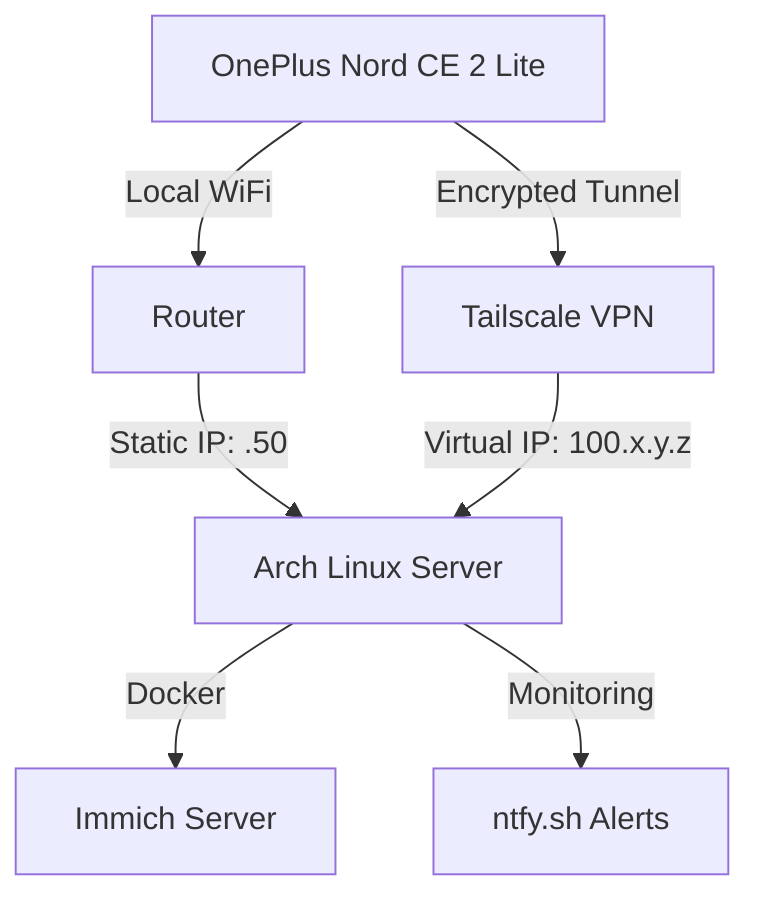

```mermaid
graph TD
    A[OnePlus Nord CE 2 Lite] -- Local WiFi --> B[Router]
    A -- Encrypted Tunnel --> C[Tailscale VPN]
    B -- Static IP: .50 --> D[Arch Linux Server]
    C -- Virtual IP: 100.x.y.z --> D
    D -- Docker --> E[Immich Server]
    D -- Monitoring --> F[ntfy.sh Alerts]

```
